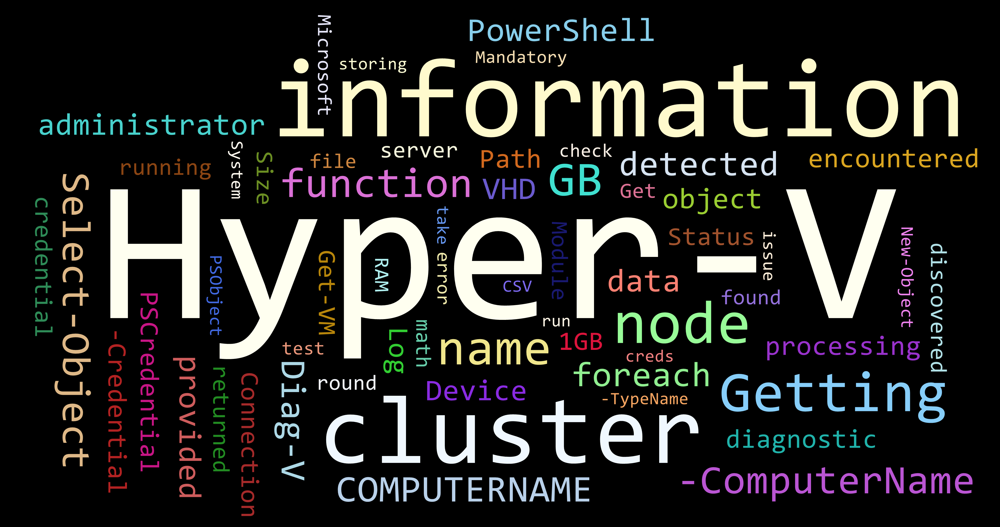

# Diag-V

[](https://github.com/PowerShell/PowerShell)
[](https://www.powershellgallery.com/packages/Diag-V)

master | Enhancements
--- | ---
 | 

## Synopsis

Diag-V is a read-only PowerShell module containing several Hyper-V related diagnostics to assist with managing standalone Hyper-V Servers and Hyper-V clusters.



## Description

Diag-V is a PowerShell Module collection of primarily Hyper-V diagnostic functions, as well as several windows diagnostic functions useful when interacting with Hyper-V servers. Hyper-V functions are cable of automatically detecting if being run against a standalone or Clustered Hyper-V instance. If a cluster is detected, data will be gathered from all nodes in the cluster. Diag-V is a read only, data gathering module that can provide rapid insight into your Hyper-V environment.

[Diag-V](docs/Diag-V.md) provides the following functions:

* [Get-AllVHD](docs/Get-AllVHD.md)
* [Get-BINSpaceInfo](docs/Get-BINSpaceInfo.md)
* [Get-CSVInfo](docs/Get-CSVInfo.md)
* [Get-FileSizeInfo](docs/Get-FileSizeInfo.md)
* [Get-HyperVLogInfo](docs/Get-HyperVLogInfo.md)
* [Get-IntegrationServicesCheck](docs/Get-IntegrationServicesCheck.md)
* [Get-SharedVHD](docs/Get-SharedVHD.md)
* [Get-VMInfo](docs/Get-VMInfo.md)
* [Get-VMLocationPathInfo](docs/Get-VMLocationPathInfo.md)
* [Get-VMReplicationStatus](docs/Get-VMReplicationStatus.md)
* [Get-VMStatus](docs/Get-VMStatus.md)
* [Test-HyperVAllocation](docs/Test-HyperVAllocation.md)

## Why

Current Hyper-V and Failover cmdlets are typically scoped to the host they are run on. *ie If you run Get-VM it only returns VMs from the host specified.*

Diag-V aims to leverage these cmdlets to provide more complete, and rapid operational insights into a Hyper-V environment.

Diag-V can quickly answer questions like these:

* How many VMs are in this cluster?
* Where are *all* the VMs stored?
* Where are *all* the VHDXs stored?
* Does the Hyper-V deployment have enough storage to accommodate dynamic VHD growth?
* What is the health status of the CSVs?
* Are any of the VMs using shared VHDXs?
* What is the replication status of my VMs?
* Do my Hyper-V servers have enough resources? Do I have room to grow?
* Can my Hyper-V cluster withstand a node failure?

## Installation

### Prerequisites

* Designed and tested on Server 2012R2 and Server 2016 Hyper-V servers running PowerShell 5.1
* Nearly all functions require the console session to be running as administrator
* Diag-V must be run as a user that has local administrator rights on the Hyper-V server
* If running diagnostics that interact with all cluster nodes Diag-V must be run as a user that has local administrator right to all members of the cluster

### Installing Diag-V via PowerShell Gallery

***This is the recommended method***

```powershell
#from an administrative 5.1.0+ PowerShell session
Install-Module -Name 'Diag-V'
```

### Installing Diag-V direct from GitHub

*Note: You will need to **build** Diag-V yourself using [Invoke-Build](https://github.com/nightroman/Invoke-Build) if you want to install directly from GitHub*

1. Download Zip from GitHub
2. Extract files
3. Navigate to download location
4. Change dir to **\src**
5. Invoke build
    ``` powershell
    Invoke-Build -Task Clean,CreateHelp,Build
    ```
6. Build will now be available in **\src\Artifacts**
7. Import Diag-V
    * Create the following directory: ```C:\Program Files\WindowsPowerShell\Modules\Diag-V```
      * Copy Artifact files into the created directory
    * Alternatively you can import module from Artifacts location manually

## Quick start

``` powershell
#-----------------------------------------------------------------------------
#import the Diag-V module
Import-Module -Name "Diag-V"
#-----------------------------------------------------------------------------
#I need to know where all my VHDX files are, and how much space they could grow to
Get-AllVHD
#-----------------------------------------------------------------------------
#could I potentially save a lot of disk space based on my VMs BIN settings?
Get-BINSpaceInfo
#-----------------------------------------------------------------------------
#I need the current state, and detailed information about my CSVs
Get-CSVInfo
#-----------------------------------------------------------------------------
#i need to find out how big this folder is, and what's taking up so much space
Get-FileSizeInfo
#-----------------------------------------------------------------------------
#what errors did my hyper-v server have in the last 12 hours?
Get-HyperVLogInfo
#-----------------------------------------------------------------------------
#what version of Integration services are my VMs running (2012/R2) - or what features are activated?
Get-IntegrationServicesCheck
#-----------------------------------------------------------------------------
#are any of my VMs using shared VHDs?
Get-SharedVHD
#-----------------------------------------------------------------------------
#I want detailed VM information for all discovered VMs in my Hyper-V deployment
Get-VMInfo
#-----------------------------------------------------------------------------
#I want to know exactly where each component of my VMs are stored
Get-VMLocationPathInfo
#-----------------------------------------------------------------------------
#what is the current replication status of my VMs?
Get-VMReplicationStatus
#-----------------------------------------------------------------------------
#what is the current status of my VMs?
Get-VMStatus
#-----------------------------------------------------------------------------
#I want a complete health report of my Hyper-V deployment
#I want to know if my Hyper-V cluster can withstand a node failure
Test-HyperVAllocation
#-----------------------------------------------------------------------------
```

## Author

[Jake Morrison](https://twitter.com/JakeMorrison) - [http://techthoughts.info/](http://techthoughts.info/)

## Contributors

[Justin Saylor](https://twitter.com/XJustinSaylorX) - Logo

## Notes

A complete write-up on Diag-V as well as a video demonstration can be found on the Tech Thoughts blog: http://techthoughts.info/diag-v/

#### Running Diag-V remotely

Diag-V leverages numerous existing cmdlets to provide rapid operational insight into your Hyper-V deployment. This makes it tricky to make Diag-V fully remote capable as some of these cmdlets support ```-ComputerName``` and ```-Credential``` while some do not. Diag-V is also cluster aware, and will scope your current or provided credentials to connect to *other* nodes in the cluster to retrieve operational data. This runs into the 'double-hop' issue as the remote machine has to pass credentials on to the other nodes to get data back.

For best results log into one Hyper-V server in the cluster and run your desired diagnostic. That said, I've enabled the majority of functions with a credential parameter. I've had success establishing a PSSession to a remote Hyper-V server, and I can specify the credential parameter which bypasses the double-hop issue. The configuration of your WinRM may affect your results. Consult each functions help for additional information.